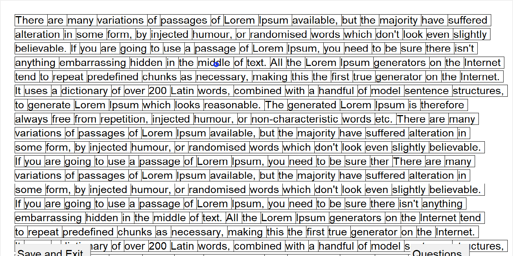
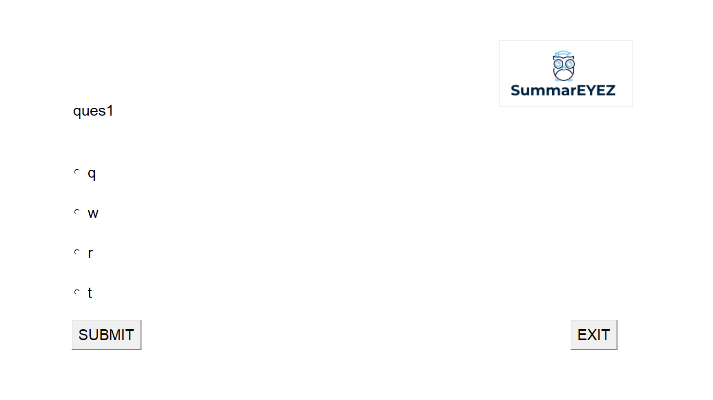
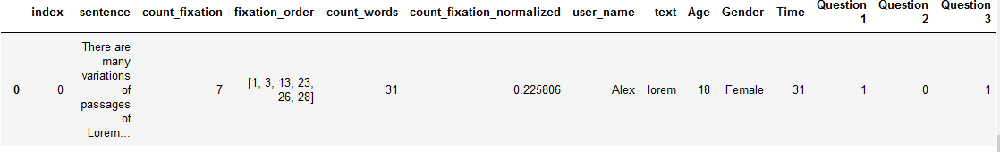

# summareyez
This is my python code for my eye tracker thesis
The program takes coordinates on display and connect them with text sentences
In my project, I use data from the eye tracker, it is possible to use the coordinates of the mouse cursor and others

For demonstration, run main.py

## Describtion
**Home screen** 
for user authorization. Texts available from folder named "texts"

"I want to see gaze point" - takes x,y coordinates, and then draws a point on the screen

**Text screen**
  While the screen is active, the weight of each sentence increases depending on the coordinates

**Question screen**

**Output**
  This is csv file in folder "results" with following features:
- index - sentence number
- sentenсe
- count_fixation - the number of coordinates received by each sentence
- fixation_order 	- order of changing sentences
- count_words 
- count_fixation_normalized - count_fixation relative to word count
- user_name
- text
- Age
- Gender
- Time - reading time all text
- Question... - 0 if wrong answer else 1

## API
**First_screen()** - create home screen
need to use mainloop

**Create_text**(user_name,user_text,text_name,user_gender,user_age,points,eye_tracker=True,verbose=True,see_rectangle=True)  
  points=boolean(True to see point on screen)
  
  eye_tracker=True - when coordinate range from 0 to 1 else False
  
  verbose=True - to see output in real time
  
  see_rectangle=True - to see rectangle around the words
  
  get_bbox(x,y) (method) - find sentence according to coordinates x,y

##**NOTE: if you run code not in jupyter notebook, need to comment rows with 'display'** 

