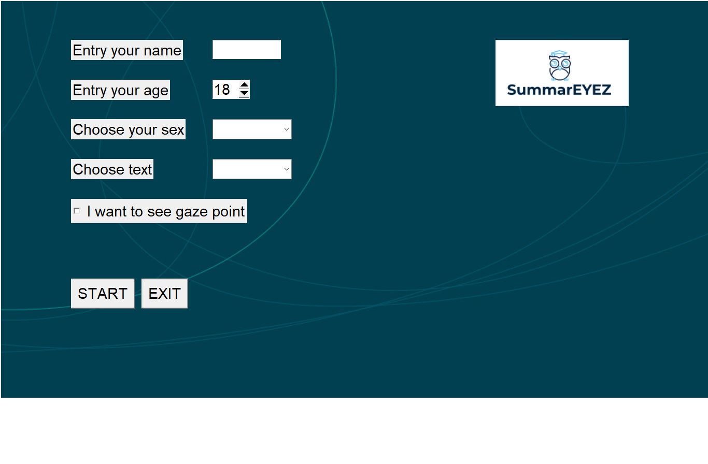

# summareyez
This is my python code for my eye tracker thesis
The program takes coordinates on display and connect them with text sentences
In my project, I use data from the eye tracker, it is possible to use the coordinates of the mouse cursor and others

For demonstration, run main.py

## Describtion
**Home screen** for user authorization. Texts available from folder named "texts"

"I want to see gaze point" - takes x,y coordinates, and then draws a point on the screen

**Text screen**
While the screen is active, the weight of each sentence increases depending on the coordinates

**Question screen**

